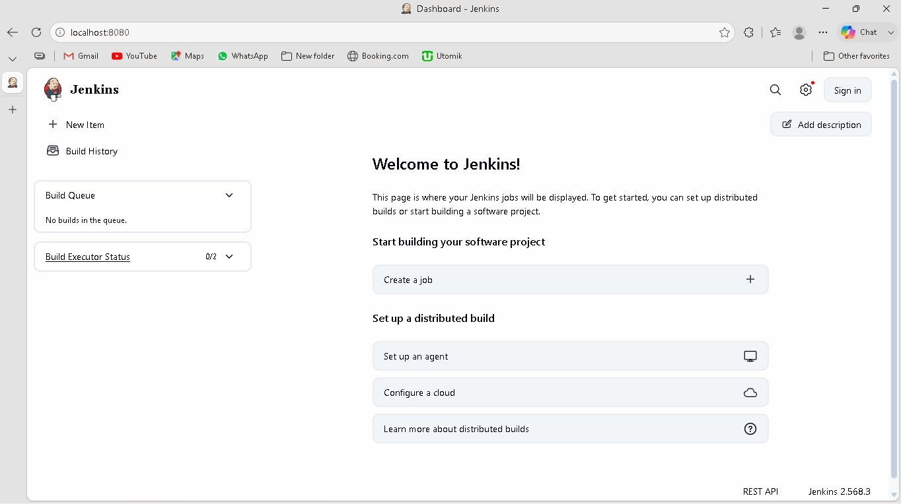

# Jenkins Remoting Project

A hands-on internship project demonstrating **Jenkins distributed builds** using Jenkins Remoting — connecting a remote Linux build agent to a Windows-based Jenkins controller over SSH.

## Objectives

- Set up Jenkins Remoting to connect remote Jenkins nodes
- Distribute build loads across different machines securely
- Run jobs on various architectures remotely
- Improve security using node isolation
- Gain hands-on experience with Jenkins' remote execution capabilities

## Architecture

```
┌─────────────────────────────┐         SSH (port 22)        ┌──────────────────────────────┐
│   Jenkins Controller         │ ─────────────────────────►   │   Jenkins Agent (Node)        │
│   Windows 11                 │                               │   Ubuntu Server 24.04 LTS     │
│   Java 21 LTS                │ ◄─────────────────────────   │   Java 21 (headless JRE)      │
│   Jenkins 2.568.3            │      Remoting protocol        │   VirtualBox VM               │
│   Inbound agent port: 50000  │                               │   User: vjenkins              │
└─────────────────────────────┘                               └──────────────────────────────┘
```

- **Controller**: Runs on the host Windows machine, manages jobs, UI, and scheduling.
- **Agent**: An isolated Ubuntu Server VM, launched via SSH, runs build jobs assigned to it — keeping untrusted/heavy build workloads off the controller (**node isolation**).
- **Networking**: VM uses a VirtualBox **Host-only Adapter** for a stable, private link to the controller, independent of Wi-Fi/router behavior.

## Setup Summary

### 1. Controller (Windows)
- Installed **Java 21 LTS** (Jenkins officially supports 21/25 — avoided a newer non-LTS JDK that was already on the machine)
- Installed **Jenkins 2.568.3** via the official Windows `.msi` installer
- Configured **Manage Jenkins → Security → Agents**: fixed the TCP port for inbound agents at **50000**, rather than leaving it random, for predictable firewall rules

### 2. Remote Node (Ubuntu VM)
- Created an Ubuntu Server 24.04 LTS VM in **VirtualBox** (1 vCPU→2 vCPUs, 1–2GB RAM, 25GB disk)
- Installed and enabled **OpenSSH server** so the controller can connect
- Installed **OpenJDK 21 (headless JRE)** — required for the Jenkins agent process to run on the node
- Created a dedicated non-root user (`vjenkins`) for the agent, rather than running as root — a basic node-isolation practice

### 3. Connecting the Node in Jenkins
- **Manage Jenkins → Nodes → New Node**, configured as a **Permanent Agent**
- **Launch method:** *Launch agents via SSH*
- **Host:** the VM's IP on the Host-only network
- **Credentials:** username/password stored in Jenkins' credential store (not hardcoded)
- **Remote root directory:** `/home/vjenkins/agent`
- Labeled the node `linux` so jobs can be explicitly targeted to it

## Challenges & Troubleshooting

This project involved real debugging, which is part of the learning value:

| Issue | Cause | Fix |
|---|---|---|
| Jenkins couldn't run on latest installed Java | Only Java 21/25 officially supported | Installed Java 21 LTS alongside, pointed Jenkins at it |
| SSH connection to VM timed out | Wi-Fi router blocked the VM's bridged MAC address (common Wi-Fi bridging limitation) | Switched VM networking to a **Host-only Adapter** for a direct, router-independent link |
| `apt install` failed on the VM after switching to Host-only | Host-only networking has no internet access by design | Temporarily used NAT to install packages, then switched back to Host-only for Jenkins connectivity |
| Agent failed to launch: `java: command not found` | No JVM installed on the remote node | Installed `openjdk-21-jre-headless` on the VM |
| VM login lockout | Password entry issue during initial setup | Reset password via Ubuntu **recovery mode** (GRUB → recovery → root shell → `passwd`) |

## Result

The agent connects successfully and shows **online** in Jenkins, ready to run distributed build jobs:

```
Agent successfully connected and online.
```

## Screenshots

**Jenkins controller running on Windows:**


**Fixed TCP port configured for inbound agents:**


**VirtualBox VM networking set to Host-only Adapter (fix for Wi-Fi bridging failure):**


**Java 21 confirmed installed on the remote agent:**


**Remote agent's IP address on the Host-only network:**


**Successful connection — agent online and ready for builds:**


## Key Takeaways

- Jenkins Remoting separates **where jobs are scheduled** (controller) from **where they execute** (agents), enabling distributed, scalable builds.
- SSH-launched agents are a secure, standard way to connect remote nodes without exposing the controller to inbound connections from the agent side.
- Running agents as isolated, non-root users limits the blast radius of a compromised or misbehaving build.
- Real-world networking issues (like Wi-Fi bridging limitations) are a common part of setting up distributed infrastructure, and troubleshooting them is as valuable as the setup itself.

## Tech Stack

- Jenkins 2.568.3
- Java 21 LTS (OpenJDK / Eclipse Temurin)
- Ubuntu Server 24.04 LTS
- Oracle VirtualBox 7.2.16
- Windows 11 (controller host)
